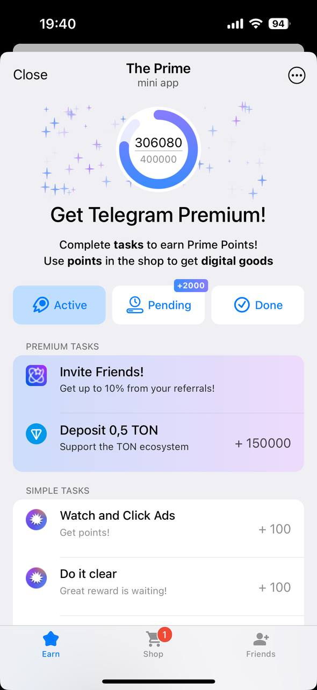
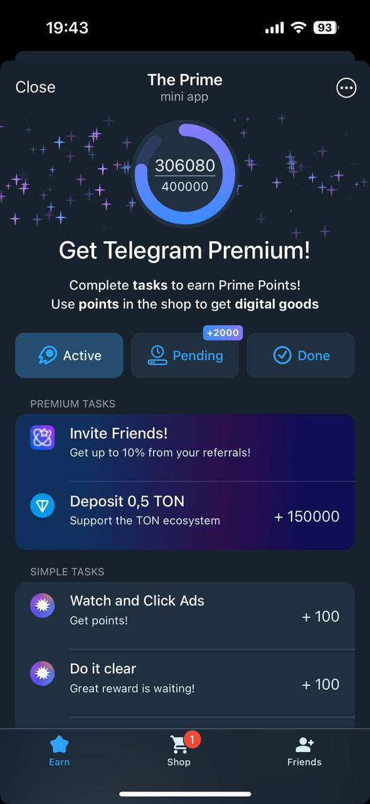
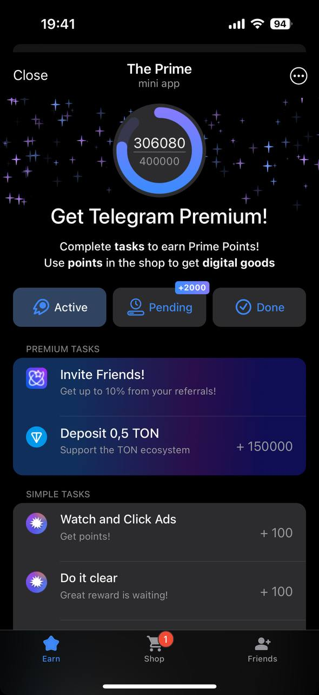

# ThePrime — Telegram Reward System

**ThePrime** is a gamified reward system built for Telegram. Users complete tasks to earn points and redeem them for digital goods like **Telegram Stars** or **Telegram Premium**, delivered via direct integration with [Fragment](https://fragment.com/).

All tasks are based on either **TON transfers** or **advertiser-sponsored actions**. The system is deeply integrated with the **TON blockchain** and optimized for performance and minimalism — both in backend logic and frontend load.

<p align="center">
  
  
  
</p>

---

## 📐 UI & Flow

The full user flow and interface design are available in Figma and Notion:

- 👉 [View in Figma](https://www.figma.com/design/NqoZJGcrMaKfYQ62evUm35/Premium-Space?node-id=27-834&m=dev)
- 👉 [View in Notion](https://pinnate-badger-b2b.notion.site/The-Prime-1ebe98c9754d80558572fbc95a532ea1)

## ⚙️ Tech Stack

- **Backend:** Go `v1.23.3`
- **Frontend:** Svelte + Webpack (via `Yarn`)
- **Database:** PostgreSQL
- **Cache:** Redis
- **Message Queue:** NATS
- **CI/CD:** GitLab
- **Deployment:** Docker + Docker Compose

---

## 🧩 Architecture

ThePrime uses a microservice architecture consisting of:

- **`api`** — Scalable HTTP API serving frontend and bot requests.
- **`worker`** — Handles business logic: task verification, PostgreSQL access, and TON blockchain interactions. Scales via configurable goroutines.
- **`webhook`** — Captures all webhook calls and pushes them into NATS to ensure reliable delivery across services.
- **`support`** — Separate Telegram-based support service for user assistance.

---

## 🧠 Task Logic

All user-facing tasks are one of two types:

- **TON-based tasks** — Blockchain operations such as sending TON, verifying wallet ownership, etc.
- **Advertiser tasks** — Actions requested by sponsors (e.g. following channels, joining bots), verified asynchronously.

---

## 📄 Local launch

```sh
docker compose -f compose.local.yml up -d

export CONFIG=$(cat ../../config.local.api.yml)
```

## 🙏 Credits

**Our amazing designer Anna Gordeeva:**

- ✉️ Email: `by.anna1990@gmail.com`
- 💬 Telegram: [@gordee_va](https://t.me/gordee_va)

**Full development (backend/frontend/deploy) by me:**

- ✉️ Email: `avpetkun@gmail.com`
- 💬 Telegram: [@avpetkun](https://t.me/avpetkun)
